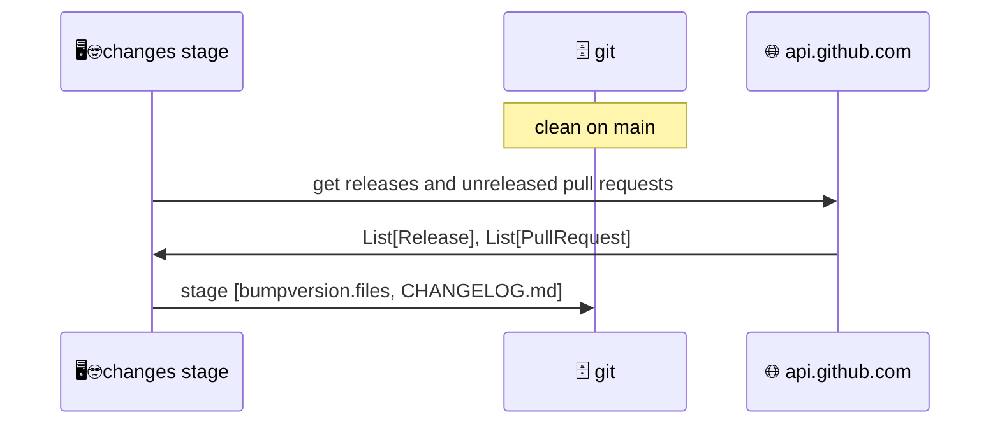

# Design

## Activity Diagrams

### changes stage

```mermaid
sequenceDiagram
    participant stage as 🖥🤓changes stage
    participant git as 🗄 git
    participant gh as 🌐 api.github.com

    Note over git: clean on main

    stage->>gh: get releases and unreleased pull requests
    gh->>stage: List[Release], List[PullRequest]
    stage->>git: stage [bumpversion.files, CHANGELOG.md]
```
