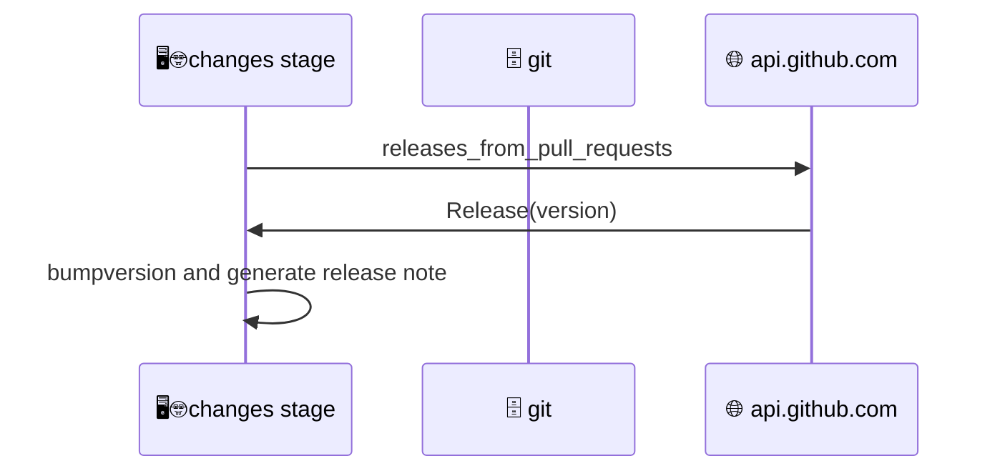
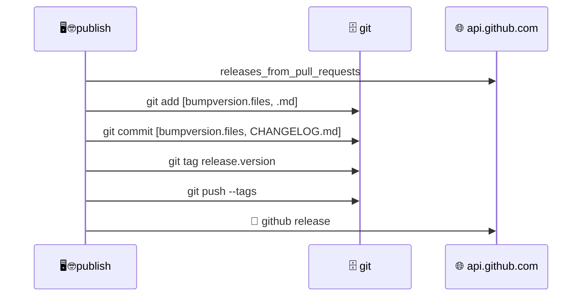

# Design

## Activity Diagrams

### changes stage

```mermaid
sequenceDiagram
    participant stage as 🖥🤓changes stage
    participant git as 🗄 git
    participant gh as 🌐 api.github.com

    stage->>gh: releases_from_pull_requests
    gh->>stage: Release(version)

    stage->>stage: bumpversion and generate release note
```

### changes publish

```mermaid
sequenceDiagram
    participant publish as 🖥🤓publish
    participant git as 🗄 git
    participant gh as 🌐 api.github.com

    publish->>gh: releases_from_pull_requests

    publish->>git: git add [bumpversion.files, .md]
    publish->>git: git commit [bumpversion.files, CHANGELOG.md]
    publish->>git: git tag release.version
    publish->>git: git push --tags

    publish->>gh: 🚀 github release
```
